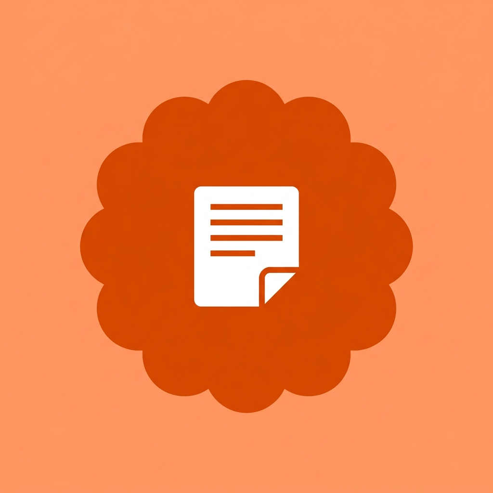

# Snippets

  

A beautiful Material 3 Expressive app to write upto 10 letters of snippets to your photos and view them in a stylised way.

Relive your moments with memories that cycles photos every few days.

Created with Antigravity, Codex, and Stitch (only in the early development stage).

<table>
  <tr>
    <td width="25%"></td>
    <td width="25%"></td>
    <td width="25%"></td>
    <td width="25%"></td>
  </tr>
</table>
